# Praktikum Modul 1 20 September 2021

## Anggota Kelompok E13
05111940000090	Ihsannur Rahman Qalbi

05111940000003	Fairuz Hasna Rofifah

05111940000164	Ahmad Aunul Ma`bud

## 1. Sebutkan webserver yang digunakan pada "ichimarumaru.tech"!
Melakukan display filter `http.host contains "ichimarumaru.tech"`. Kemudian Follow TCP Stream, didapat:

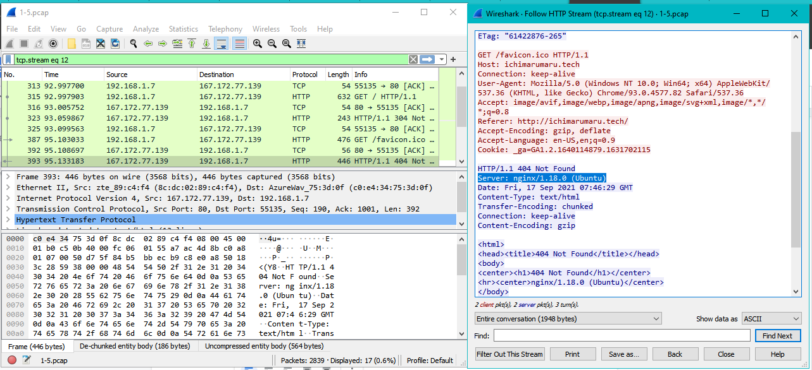

Didapat server: nginx/1.18.0 (Ubuntu)
## 2. Temukan paket dari web-web yang menggunakan basic authentication method!
Melakukan display filter `http.authbasic`, kemudian didapat paket-paket yang memakai authentication basic.

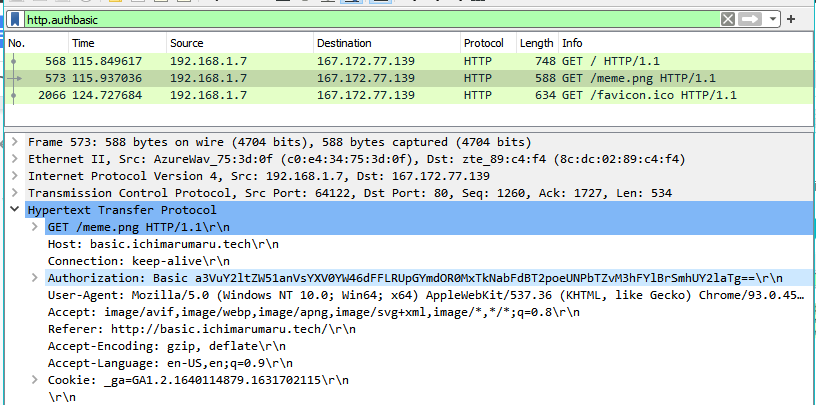

## 3. Ikuti perintah di basic.ichimarumaru.tech! Username dan password bisa didapatkan dari file .pcapng!
Melakukan display filter `http.host contains "basic.ichimarumaru.tech"`. Kemudian mencari paket yang memiliki authorization, kemudian didapat credentialnya adalah `kuncimenujulautan:tQKEJFbgNGC1NCZlWAOjhyCOm6o3xEbPkJhTciZN`

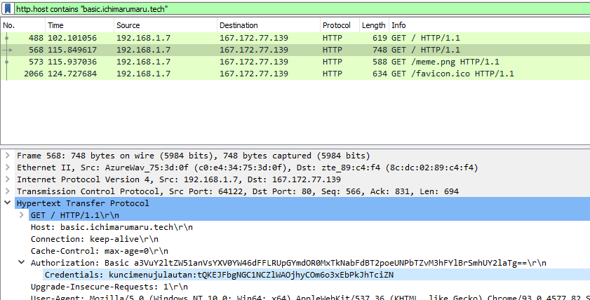

Kemudian mengunjungi basic.ichimarumaru.tech dan memasukkan credential, kemudian menyelesaikan misi pada web tersebut.

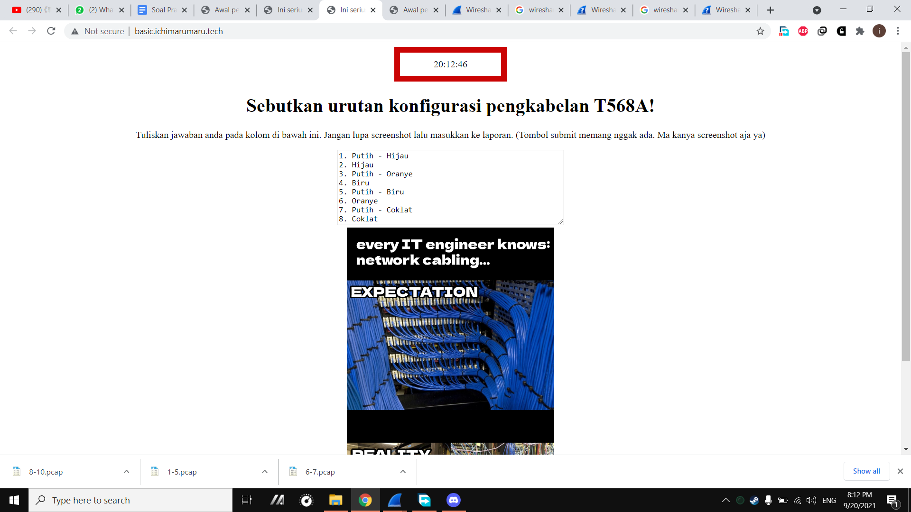

## 4. Temukan paket mysql yang mengandung perintah query select!

Melakukan display filter `mysql contains "select" || mysql contains "SELECT"`.

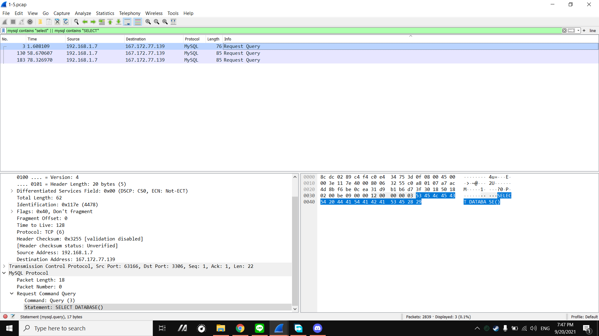

## 5. Login ke portal.ichimarumaru.tech kemudian ikuti perintahnya! Username dan password bisa didapat dari query insert pada table users dari file .pcap!
Melakukan display filter `mysql contains "insert" || mysql contains "INSERT"`.

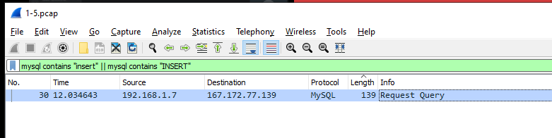

Kemudian Follow TCP Stream, didapat username dan passwordnya, `akakanomi:pemisah4lautan`.

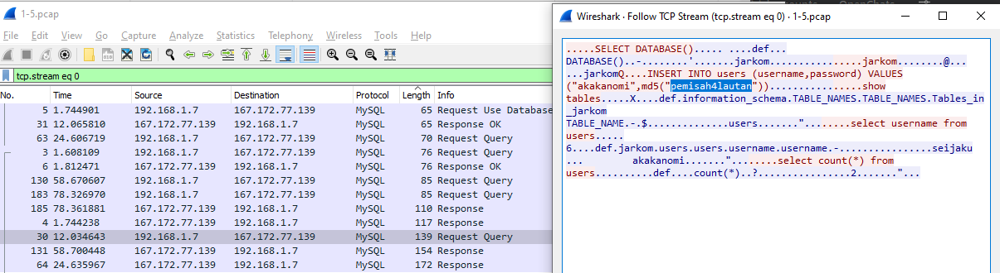

Kemudian login ke portal.ichimarumaru.tech dan jalankan misi.

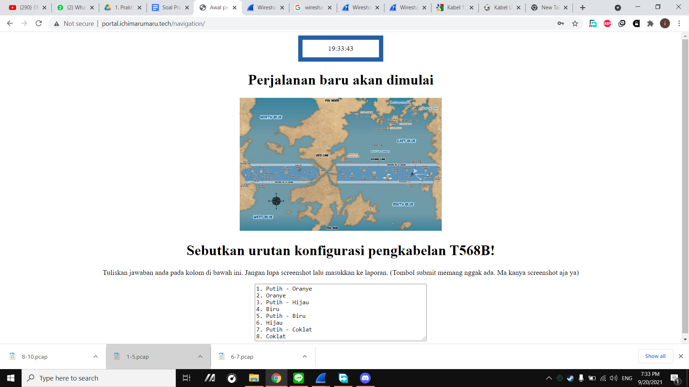

## 6. Cari username dan password ketika melakukan login ke FTP Server!

Melakukan display filter `ftp.request.command == USER || ftp.request.command == PASS`. Kemudian didapat username dan passwordnya, `secretuser:aku.pengen.pw.aja`.

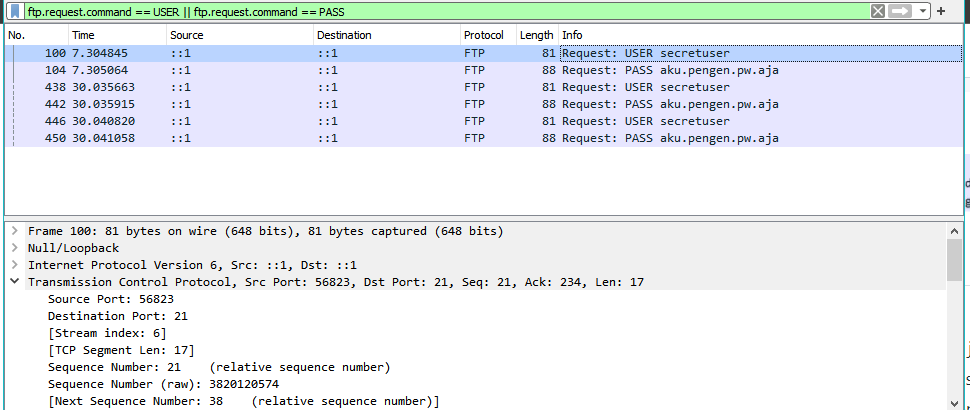

## 7. Ada 500 file zip yang disimpan ke FTP Server dengan nama 0.zip, 1.zip, 2.zip, ..., 499.zip. Simpan dan Buka file pdf tersebut. (Hint = nama pdf-nya "Real.pdf")

Melakukan display filter `ftp-data contains "Real.pdf"`.

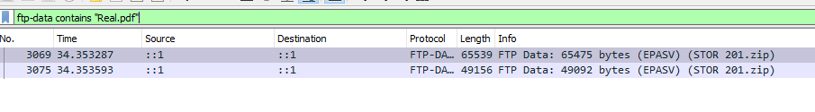

Kemudian follow -> TCP Stream -> show data as raw -> save as “Real.pdf”

## 8. Cari paket yang menunjukan pengambilan file dari FTP tersebut!

Melakukan display filter `ftp.request.command == STOR`.

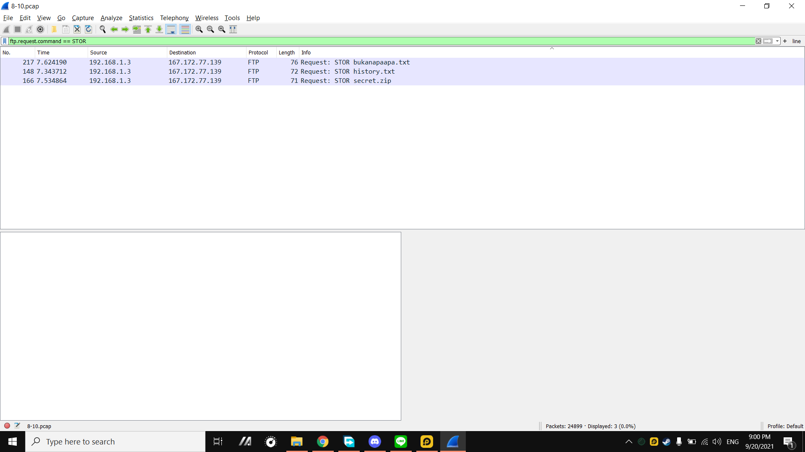

## 9. Dari paket-paket yang menuju FTP terdapat inidkasi penyimpanan beberapa file. Salah satunya adalah sebuah file berisi data rahasia dengan nama "secret.zip". Simpan dan buka file tersebut!
## 10. Selain itu terdapat "history.txt" yang kemungkinan berisi history bash server tersebut! Gunakan isi dari "history.txt" untuk menemukan password untuk membuka file rahasia yang ada di "secret.zip"!
## 11. Filter sehingga wireshark hanya mengambil paket yang berasal dari port 80!
a.  Menggunakan `src port 80` pada capture filter

b.  Membuka [monta.if.its.ac.id](monta.if.its.ac.id) untuk mendapatkan packet yang berasal dari port 80

## 12. Filter sehingga wireshark hanya mengambil paket yang mengandung port 21!
a.  Menggunakan `port 20` pada capture filter

b.  Membuka (ftp://ftp.adobe.com)[ftp://ftp.adobe.com] untuk mendapatkan packet yang mengandung port 20

## 13. Filter sehingga wireshark hanya menampilkan paket yang menuju port 443!
## 14. Filter sehingga wireshark hanya mengambil paket yang tujuannya ke kemenag.go.id!
## 15. Filter sehingga wireshark hanya mengambil paket yang berasal dari ip kalian!

## Kendala dalam Pengerjaan
